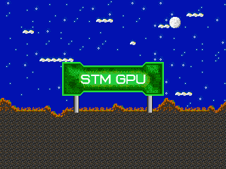

# *STMsGPU*
2D software GPU for *Arduino* (or Desktop)
***


Today a lot of code is written for *Arduino*, and we all know limitations of these platform,  
for example extremely slow drawing on *LCD* screens, not enough *ROM*, huge *SD* libs and other!

But what if You want to use these *MCUs* longer, and you have no choise exept to select another *MCUs* or get much bigger *MCUs*?

That is why this *sGPU* coprocessor project was created!  
Created for simple *MCUs* (like AVR) to help accelerate 2d graphics on *LCDs*  
by using powerful *MCUs* like *ARM STM32*.

*sGPU* coprocessor can save *ROM* space, *RAM*, release *MCU_CPU* from executing code for *LCD* and left more resources for main application!

For maximum simplicity serial port (*UART*) was selected as main communication interface.  
There are lot of realizations of this interface (as hardware as software) for all type of *MCUs* and even Desktop!

Flexible baudrate selection allows to match from lowest to highest transfer speed (some *MCUs* has no resonators and required low speed).  
Only two lines is used to communicate (even one line is possible).

Just send commands to *UART* like it's an *LCD* and *sGPU* do it's job.

***Host* libs was written on C, C++ and Python, so it can be simply ported to where you want!**

All this allow to use *Host* even like *AVR ATtiny* family, isn't cool huh?

Also code for *STM32* was writed in *System Workbench(sw4stm32)* with *SPL* to get maximum of hardware!

#####To see how does it work check [this link](https://www.youtube.com/channel/UCDXVQ9ZfQl8Ddeu_3qiwSiA "My YouTube channel")

***
##### Used *MCU* for *sGPU*:
  * STM32F103C8T6 (Mapple mini) *as mini version*
  * STM32F103VET6 (ministm32) *as mini2 version*
  * STM32F407VET6 (Black dev. board with nrf24L01) *as Pro version*
  
##### As *Host* can be used:
  * Any capable board with *Arduino IDE*: Uno, nano, STM32, e.t.c.
  * *PC* with *USB2UART* or *Bluetooth UART*
  * Anything what have *Rx*, *Tx* and GND lines
  * Anything what support as software as hardware serial port (UART)
  * All above must be 3v-5v tolerant

##### There are three *Host* libs:
  * **C version**(*C_AVR_Libs*), mostly optimized for *ATmega328p* or similar (also works in *Arduino IDE*)
  * **C++ version**(*Arduino_lib*), support most of know *MCUs*, even STM32!
  * **Python version**(*Desktop*), can run same things on Posix/Windows machine, instead of *MCUs*

##### Also there are two projects for stm32:
  * **stm32_sGPU** for stm32f1xx *MCUs*
  * **stm32_sGPU_Pro** for stm32f4xx *MCUs*
  
##### *GPIO* pinout for *sGPU* can be find in:
  * [STM32_GPU_GPIO_Pinout.txt](/STM32_Project/STM32_GPU_GPIO_Pinout.txt)
  * [STM32_GPU_Mini_GPIO_Pinout.png](/STM32_Project/STM32F103C8T6_pinout.png)
  * [STM32_GPU_Pro_GPIO_Pinout.png](/STM32_Project/STM32F407VET6_pinout.png)

***
###Tests results over Bluetooth on Desktop and 57600 baudrate
#####*sGPU Pro:*
```
Benchmark               Time (milliseconds)
FillScreen              : 63
Text                    : 101
Lines                   : 854
Horiz/Vert Lines        : 213
Rectangles (outline)    : 101
Rectangles (filled)     : 187
Circles (filled)        : 326
Circles (outline)       : 373
Triangles (outline)     : 92
Triangles (filled)      : 148
Rounded rects (outline) : 151
Rounded rects (filled)  : 128
Rotation                : 504
Done!
```

#####*sGPU Mini:*
```
Benchmark               Time (milliseconds)
FillScreen              : 172
Text                    : 107
Lines                   : 1089
Horiz/Vert Lines        : 206
Rectangles (outline)    : 103
Rectangles (filled)     : 414
Circles (filled)        : 351
Circles (outline)       : 373
Triangles (outline)     : 98
Triangles (filled)      : 252
Rounded rects (outline) : 133
Rounded rects (filled)  : 458
Rotation                : 601
Done!
```

> ##### :exclamation: ATTENTION! :exclamation:
> ###### * This project is still unstable and not ready for production! :beetle:
> ###### * Any changes in main protocol are possible at any time,
> ###### * and no backward capability is guaranteed!
